# PhotoFlow

Welcome to our React Native app project! This app is designed to provide users with a visually engaging platform to share and explore photos. With features like a home feed, profile tabs, and a splash screen, it offers a comprehensive social media experience focused on visual content.

## Features

- **Home Feed**: Users can scroll through a curated list of photos shared by others. Each photo comes with information about the user who posted it. See [`HomePage.tsx`] for implementation details.

- **Profile Tab**: Offers a personalized view where users can see their own posts and manage their profile. Implemented in two versions: [`ProfileTab.tsx`] and [`ProfileTab.tsx`], with the latter including additional features like error handling for profile pictures.

- **Splash Screen**: A visually appealing splash screen that displays while the app is loading. Implemented in `Splash.tsx`.

## Screenshots

Below is a screenshot of the app in action:

<div style="display: flex; flex-wrap: wrap;">
  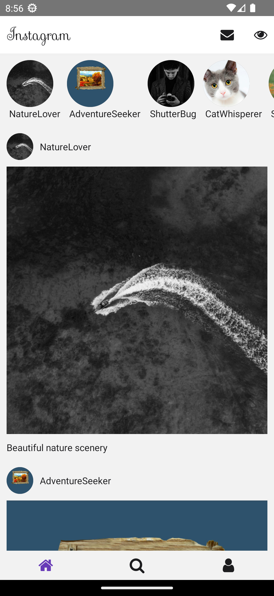
  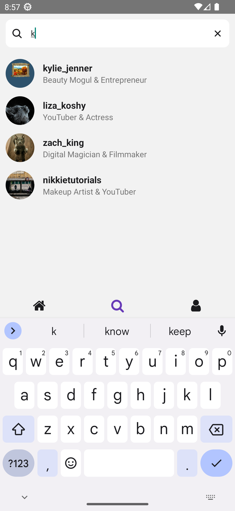
  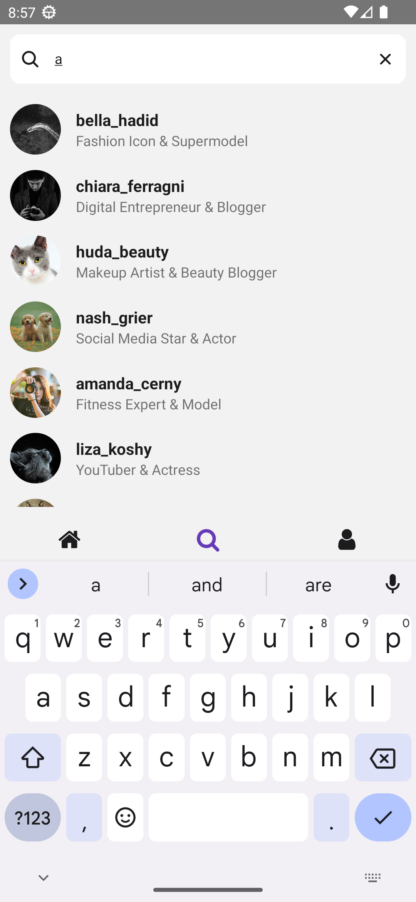
  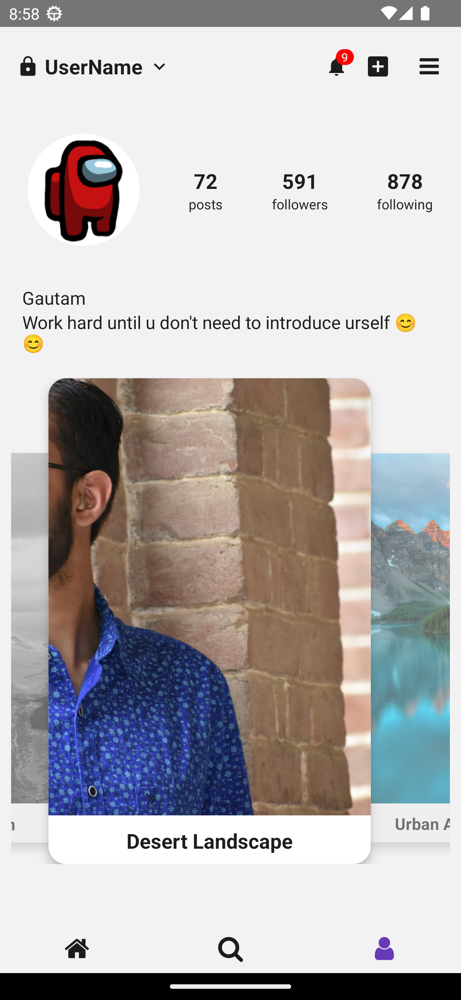
  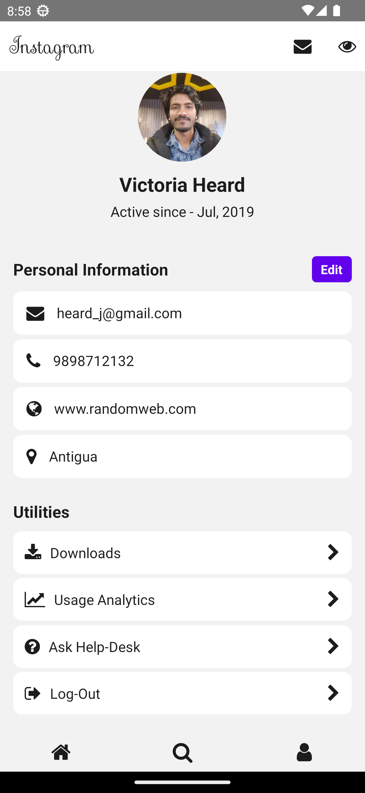
  
  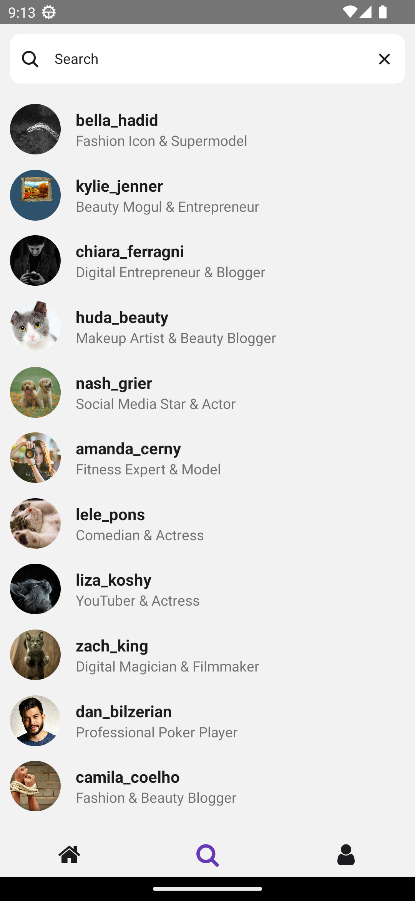
  
  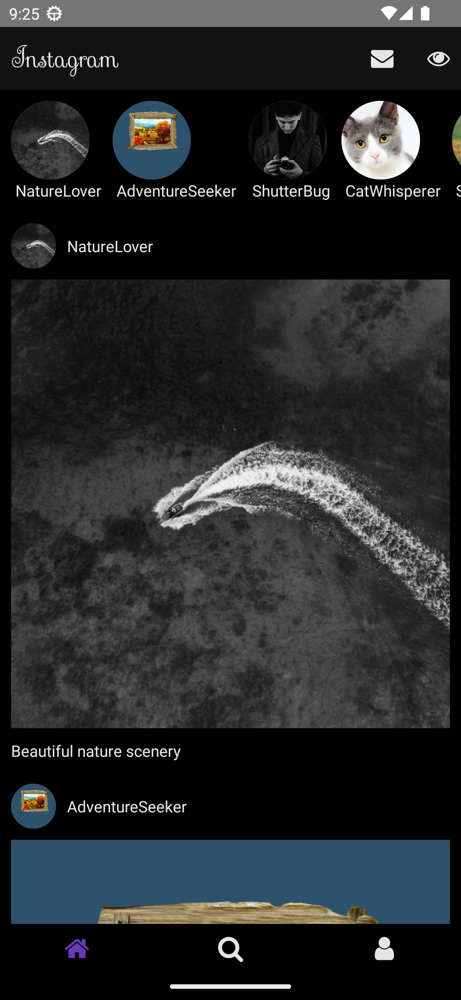
  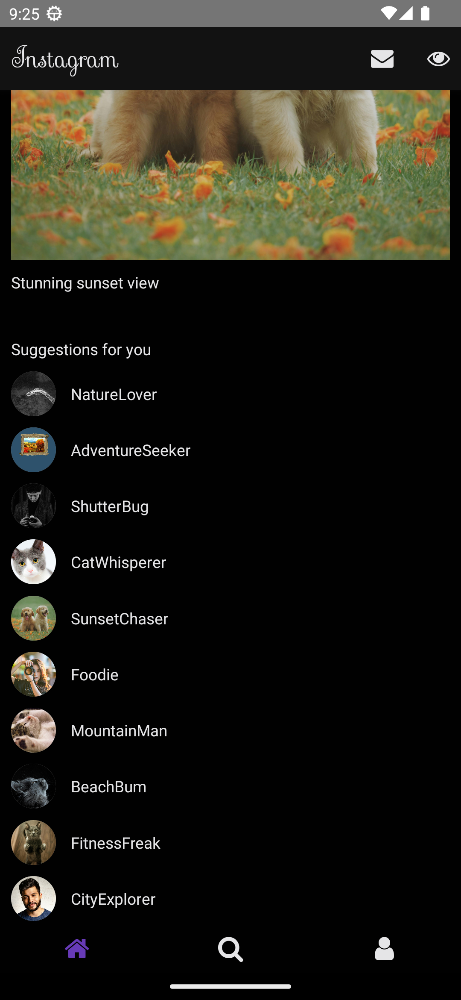
  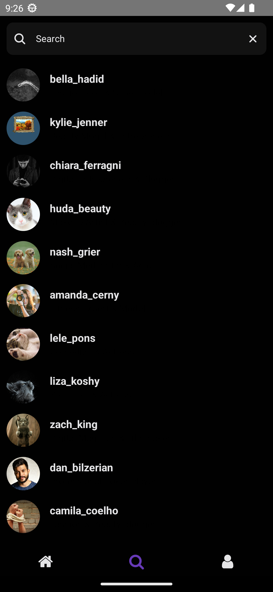
  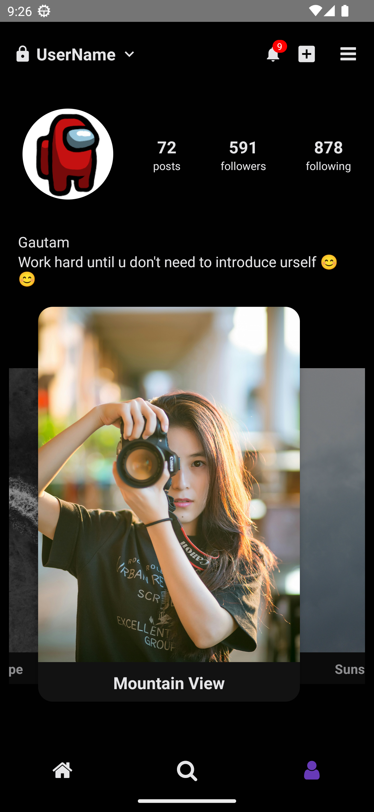
  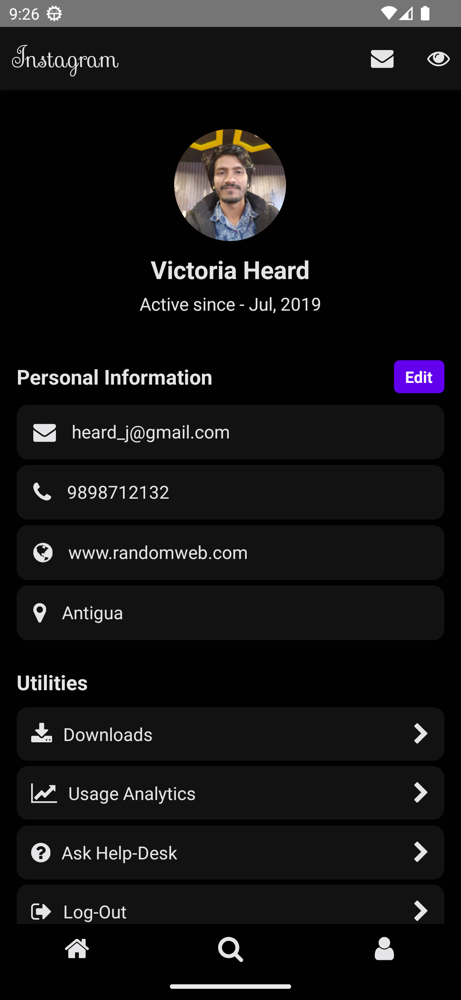
</div>

*Note: The screenshots are actual screenshots of the app.*

## Getting Started

To get a local copy up and running, follow these simple steps.

### Prerequisites

- Node.js
- npm
```sh
npm install npm@latest -g
```

### Installation

1. Clone the repo
```sh
git clone https://github.com/codingdud/PhotoFlow
```
2. Install NPM packages
```sh
npm install
```
3. Start the app
```sh
npm start
```

## Usage

For more examples, please refer to the Documentation

## Contributing

Contributions are what make the open-source community such an amazing place to learn, inspire, and create. Any contributions you make are **greatly appreciated**.

1. Fork the Project
2. Create your Feature Branch (`git checkout -b feature/AmazingFeature`)
3. Commit your Changes (`git commit -m 'Add some AmazingFeature'`)
4. Push to the Branch (`git push origin feature/AmazingFeature`)
5. Open a Pull Request
